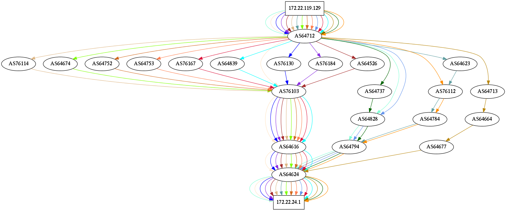
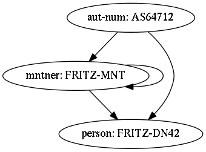
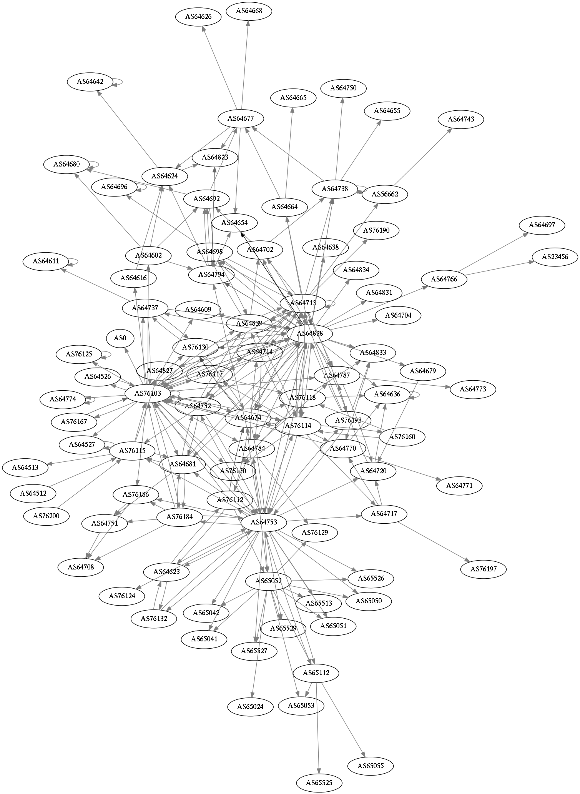
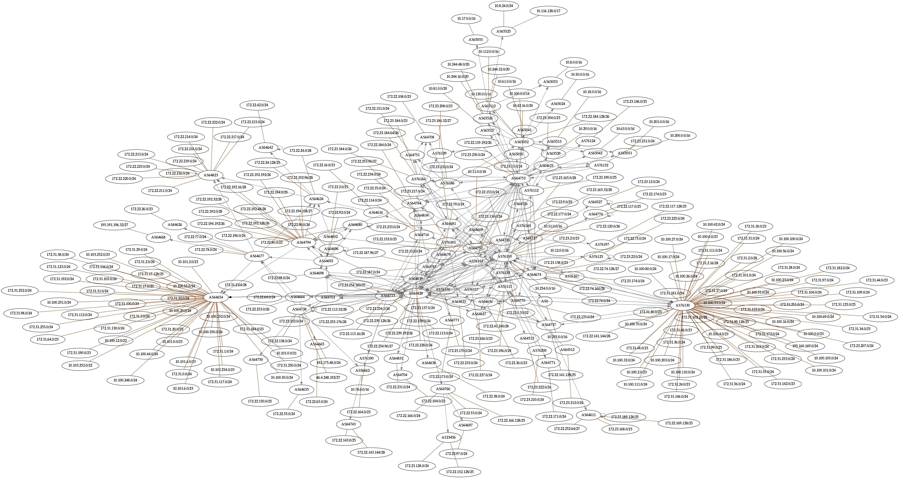

:mod:`lglass-dot` – Routing and registry visualisation
======================================================

`lglass-dot` is a tool to export routing and registry information as GraphVIZ
input. At the moment it supports routing graphs, a registry relation graph and
a peering graph.

::

  usage: lglass-dot [-h] {database,peering,network,routing,help} ...

  positional arguments:
    {database,peering,network,routing,help}

  optional arguments:
    -h, --help            show this help message and exit

Routing Graph
-------------

This generates a peering graph from an exported RIB (e.g. from :doc:`lglass-bird <lglass-bird>`).
It takes the local IP address, the destination IP address, and the local AS, and
builds a GraphVIZ directed graph which will contain any possible path from the
local IP address to the destination IP address.

::

  usage: lglass-dot routing [-h] [-f {cbor,json}]
                            destination local_ip local_as rtables [rtables ...]

  positional arguments:
    destination
    local_ip
    local_as
    rtables

  optional arguments:
    -h, --help            show this help message and exit
    -f {cbor,json}, --format {cbor,json}

  Routing graph for destination 172.22.24.1 and source 172.22.119.129 in AS64712

Registry Graph
--------------

This subcommand generates a graph which contains any related object to given
database objects or, if the objects are omitted, then the whole database and
the relationships between the objects. Each object in the command line is a
pair of a type and a primary key argument.

::

  usage: lglass-dot database [-h] [-d DATABASE] [objects [objects ...]]

  positional arguments:
    objects

  optional arguments:
    -h, --help            show this help message and exit
    -d DATABASE, --database DATABASE

  Registry graph for registry object AS64712 (type aut-num)

Peering Graph
-------------

This subcommand generates an overview of peering policies for each autonomous
system using an exported RIB.

::

  usage: lglass-dot peering [-h] [-f {cbor,json}] rtables [rtables ...]

  positional arguments:
    rtables

  optional arguments:
    -h, --help            show this help message and exit
    -f {cbor,json}, --format {cbor,json}

  Peering graph for DN42 network

Network Graph
-------------

This subcommand is similar to the peering subcommand except that it includes
the announced IP prefixes.

::

  usage: lglass-dot network [-h] [-f {cbor,json}] rtables [rtables ...]

  positional arguments:
    rtables

  optional arguments:
    -h, --help            show this help message and exit
    -f {cbor,json}, --format {cbor,json}

  Network graph for DN42 network

